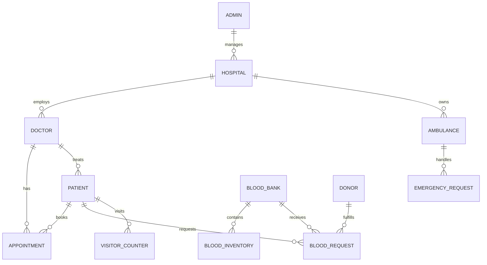

# ER Diagram

Below is the comprehensive Entity-Relationship (ER) diagram and description for the Doctors Appointment System. Use the Mermaid code to render the diagram in VS Code or online.

---

## Entities and Key Attributes

### Admin
- _id (PK)
- name
- email (unique)
- password
- role

### Hospital
- _id (PK)
- name
- email (unique)
- password
- role
- phone
- address (building, lane, street, city, state, zipCode, country)
- location (GeoJSON Point)

### Doctor
- _id (PK)
- name
- email (unique)
- age
- contact
- contactNumber
- bloodGroup
- password
- hospitalId (FK → Hospital)
- specialization, etc.

### Patient
- _id (PK)
- name
- email (unique)
- age
- contactNumber
- bloodGroup
- password
- geoLocation (GeoJSON Point)

### Appointment
- _id (PK)
- patientId (FK → Patient)
- doctorId (FK → Doctor)
- appointmentDate, appointmentTime
- status (scheduled, completed, cancelled)
- medicineDescription, diagnosis, medicalPrescription
- paymentMethod, paymentAmount, paymentStatus

### Ambulance
- _id (PK)
- vehicleNumber (unique)
- driverName, driverPhone, driverEmail
- password
- driverBloodGroup
- hospitalId (FK → Hospital)
- location (GeoJSON Point)

### EmergencyRequest
- _id (PK)
- patientId (FK → Patient)
- ambulanceId (FK → Ambulance)
- hospitalId (FK → Hospital)
- doctorId (FK → Doctor)
- location (GeoJSON Point)
- status

### BloodBank
- _id (PK)
- hospitalId (FK → Hospital)
- name, address, location

### BloodInventory
- _id (PK)
- bloodBankId (FK → BloodBank)
- bloodGroup
- unitsAvailable, reservedUnits, criticalThreshold, lastRestockedAt, expiresSoonUnits, isActive

### BloodRequest
- _id (PK)
- requesterId (FK → Patient/Doctor/Hospital/Admin)
- requesterRole (patient, doctor, hospital, admin)
- bloodGroup, unitsRequired, urgencyLevel
- location (GeoJSON Point)

### Donor
- _id (PK)
- sourceType (community, patient, doctor, driver)
- sourceRefId (FK → Patient/Doctor/Driver)
- fullName, age, weightKg, bloodGroup, contact, location

---

## Relationships

- **Admin** manages **Hospital** (One-to-Many)
- **Hospital** employs **Doctor** (One-to-Many)
- **Doctor** has **Appointment** (One-to-Many)
- **Patient** books **Appointment** (One-to-Many)
- **Hospital** owns **Ambulance** (One-to-Many)
- **Ambulance** handles **EmergencyRequest** (One-to-Many)
- **Patient** requests **BloodRequest** (One-to-Many)
- **BloodBank** contains **BloodInventory** (One-to-Many)
- **BloodBank** receives **BloodRequest** (One-to-Many)
- **Donor** fulfills **BloodRequest** (One-to-Many)
- **Doctor** treats **Patient** (One-to-Many)
- **Patient** visits **VisitorCounter** (One-to-Many, model not found in codebase)

---

**Notes:**
- All relationships are implemented via foreign keys (ObjectId references in Mongoose).
- Some entities (like VisitorCounter) are referenced in the ER diagram but not found in the codebase.
- The system uses GeoJSON Points for location fields in several entities.
- BloodRequest and Donor are flexible to support multiple requester/fulfiller types.
