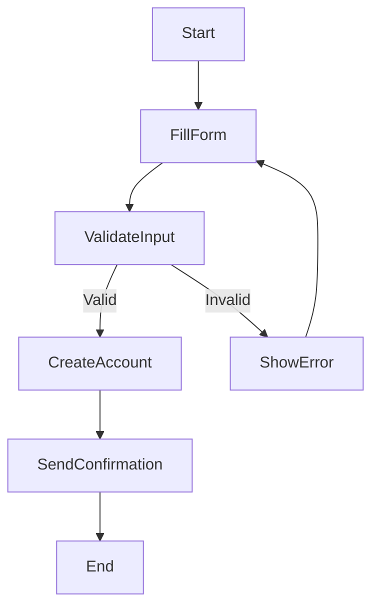

# Activity Diagram: Patient Registration

---

**Description:**
This activity diagram illustrates the process of patient registration in the Doctors Appointment System:
- The process starts when a patient initiates registration.
- The patient fills out the registration form.
- The system validates the input.
- If the input is valid, an account is created and a confirmation is sent.
- If invalid, an error is shown and the patient can retry.
- The process ends after confirmation is sent.