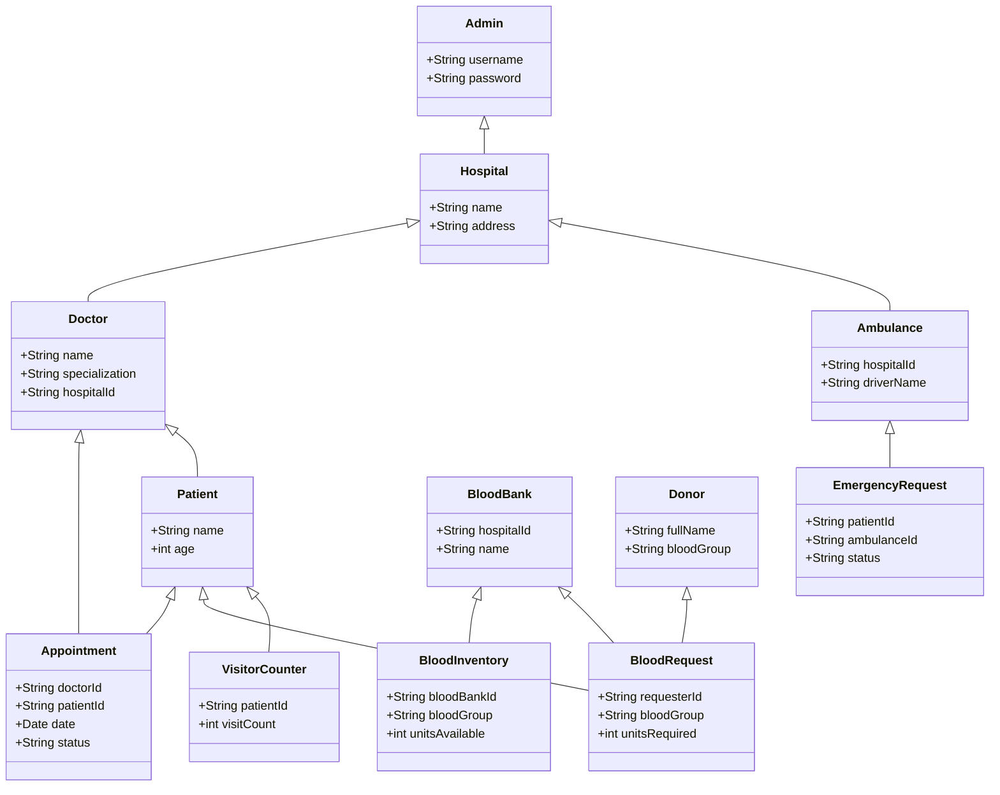

# Class Diagram



---

**Description:**
This class diagram shows the main classes/entities in the system, their attributes, and relationships (inheritance, association, aggregation) as implemented in the backend models.
      +String hospitalId
      +String driverName
    }
    class EmergencyRequest {
      +String patientId
      +String ambulanceId
      +String status
    }
    class BloodBank {
      +String hospitalId
    }
    class BloodInventory {
      +String bloodBankId
      +String bloodType
      +int units
    }
    class BloodRequest {
      +String patientId
      +String bloodBankId
      +String status
    }
    class Donor {
      +String name
      +String bloodType
    }
    class VisitorCounter {
      +String patientId
      +int count
    }
```

---

**Explanation:**
- Shows main classes/entities and their relationships.