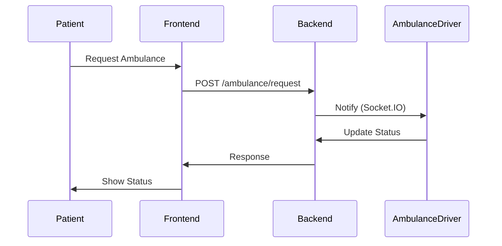

# Communication Diagram: Ambulance Request

---

**Description:**
This communication diagram details the message flow for an ambulance request:
- Patient initiates a request via the frontend.
- Frontend sends the request to the backend.
- Backend notifies the ambulance driver (e.g., via Socket.IO).
- Driver updates status back to backend.
- Backend responds to frontend, which updates the patient.