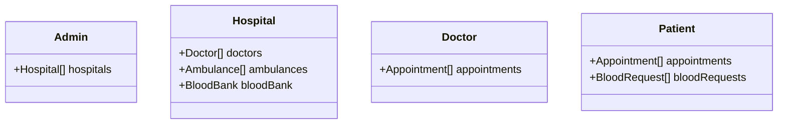

# Composite Structure Diagram

---

**Description:**
This composite structure diagram shows how main entities are composed of or aggregate other entities:
- Admin manages multiple hospitals.
- Hospital contains doctors, ambulances, and a blood bank.
- Doctor and patient have lists of appointments; patient also has blood requests.