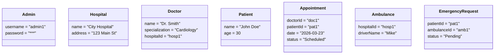

# Object Diagram

---

**Description:**
This object diagram shows a snapshot of the system after a patient books an appointment, with example attribute values and links between objects.

**Explanation:**
- Shows example objects and their attribute values at a specific time.