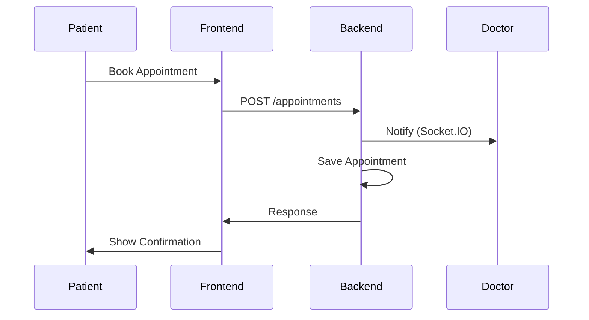

# Sequence Diagram: Appointment Booking

---

**Description:**
This sequence diagram shows the flow of booking an appointment:
- Patient initiates booking via frontend.
- Frontend sends booking request to backend.
- Backend notifies doctor and saves appointment.
- Backend responds to frontend, which confirms to patient.