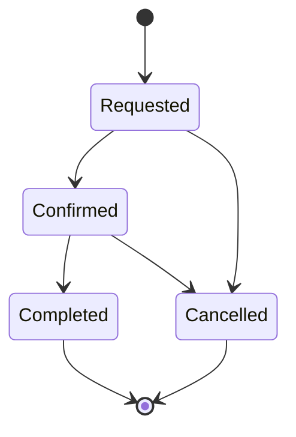

# State Diagram: Appointment

---

**Description:**
This state diagram shows the lifecycle of an appointment:
- Appointment starts as Requested.
- Can be Confirmed or Cancelled.
- Confirmed appointments can be Completed or Cancelled.
- Completed and Cancelled are terminal states.