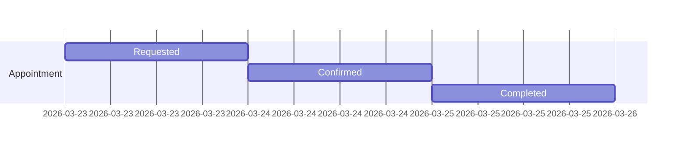

# Timing Diagram: Appointment Lifecycle

---

**Description:**
This timing diagram shows the time-based progression of an appointment:
- Requested: Initial state.
- Confirmed: After request is accepted.
- Completed: After appointment is fulfilled.